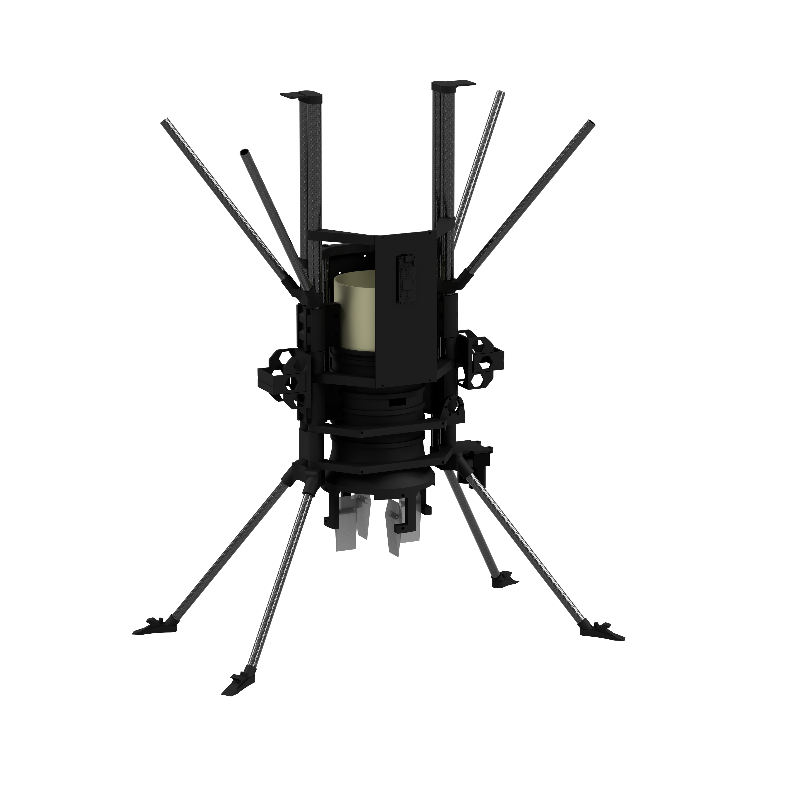

# Appendix
This repo is the digital appendix of the thesis Flight control system for hovering a 'Ducted-Fan' prototype.

## CAD
The CAD folder contains the master fusion 360 file with all mechanical components.

## Flight computer
The FlightComputer folder contains the flight computer c++ code. 

## Ground station
The GroundStation folder contains all C# classes written for the Ground station app

## Simulink
The Simulink folder contains the Matlab and Simulink files.

## Video
External links to the videos

[![1min Trailer]Img/mq1.jpg)](https://youtu.be/vIfVS0Zq51c "1min Trailer - Click to Watch!")

## Flight data
The Flight data folder contains the flight data in a CSV format.

## External links

# Project Overview
This thesis aims to develop a flying object powered by a ducted fan
capable of hovering by itself. In order to hover, the following parameters 
must be controlled: pitch, roll, yaw, and altitude. The thesis describes
the steps of developing a ducted fan prototype from the initial idea to 
the hovering prototype. In addition, all related sources used in this thesis
are summarised and referenced in the bibliography. The flight performance of
the prototype is evaluated using the onboard logged sensor values. These log
files contain all sensor values (including speed estimations), control system
outputs and processor time. In addition to the logfiles, high speed (120fps) 4k
video footage is recorded for visual analysis of the flight. The resulting prototype 
can hover upright. However, a horizontal drift is still noticeable. It is certainly 
possible to eliminate the horizontal drift with a more accurate GPS and a better speed
estimation algorithm.

## Task and Goal
The thesis consists of four main tasks. The first task is the mechanical design of the prototype, containing all structural components, weight and balance considerations, and the aerodynamic design. 
The second part is the electrical design. This part focuses on the different electrical components used on the prototype (Avionics), including the flight computer, sensors, high power wiring for the ducted fan, batteries and the signal buses between the components. 
The third part is the software design, which is split between the two programs needed. The prototypes flight computer software will be the central part in controlling the prototype and the iPad app used to monitor the flight from the ground. 
The final part is the conception of the control system which includes the physical measurement of the prototype and the subsequent creation of a Simulink model that can simulate it’s flight. The control system is tuned with the Simulink model and real flight tests until the prototype can hover.
